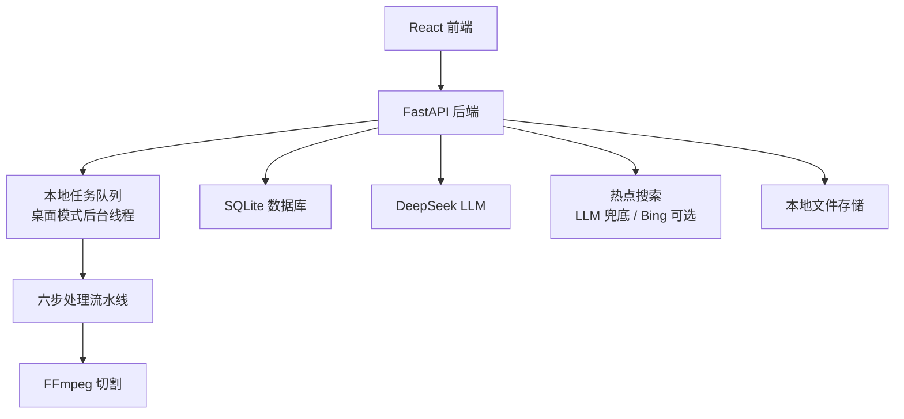

<div align="center">

# MyCut — AI 视频剪辑 Agent

**查热点 → 生成大纲/文案 → 本地上传 → 自动切片 + 匹配字幕**

一条从选题到成片的创作闭环。

[](https://python.org)
[](https://reactjs.org)
[](https://fastapi.tiangolo.com)
[](https://www.typescriptlang.org)
[](https://deepseek.com)
[](LICENSE)

</div>

## 🎯 项目简介

MyCut 是一个面向内容创作者的 **AI 视频剪辑 Agent**。它把"想选题"到"出成片"串成一条闭环:

1. **AI 联网查热点** — 输入领域/关键词,AI 归纳当下热点选题,生成可选的选题卡片。
2. **生成大纲与文案** — 选定选题后一键生成视频大纲(hook / 分段 / CTA)和分镜文案,全程可就地编辑,并保存到「文案库」。
3. **本地上传视频** — 拿着文案去拍,拍完把视频(可选带字幕 SRT)导入 MyCut,可关联此前保存的文案。
4. **自动切片 + 匹配字幕** — 六步流水线自动分析、切割精彩片段并生成标题;带文案时会按文案要点对齐评分,让切片更贴合你的脚本。

采用前后端分离架构,**桌面本地运行、无需 Redis**,LLM 默认使用 **DeepSeek**。

## ✨ 核心特性

- 🔥 **AI 查热点**:联网/大模型归纳当下热点,直接产出可用选题(数据源可插拔,默认 LLM 兜底,可接 Bing)。
- 📝 **大纲 + 分镜文案**:从选题一键生成结构化大纲与逐镜文案,就地编辑、保存进文案库,支持"用这个文案剪视频"。
- 📤 **本地上传**:拖拽导入本地视频与字幕,聚焦本地素材创作(不含任何平台下载/投稿)。
- ✂️ **自动切片**:AI 分析内容、识别精彩片段并自动切割,生成吸引人的标题。
- 🎯 **文案对齐**:上传时关联文案后,评分环节偏向匹配你脚本要点的片段(旁路增强,不影响无文案的常规切片)。
- 📚 **合集聚类**:对切片做主题聚类,自动组织成合集。
- 🎨 **克制专业界面**:React + TypeScript + Ant Design,单一橙色强调、支持浅色/深色主题(设计规范见 [DESIGN.md](DESIGN.md))。
- 🖥️ **桌面本地模式**:任务在后台线程本地执行,**无需 Redis**,开箱即用。

## 🏗️ 系统架构



### 六步处理流水线

| 步骤 | 模块 | 作用 |
|------|------|------|
| step1 | outline | 提取视频大纲与关键信息 |
| step2 | timeline | 识别话题时间区间 |
| step3 | scoring | 对片段做精彩度评分(有文案时按要点对齐) |
| step4 | title | 为片段生成标题 |
| step5 | clustering | 主题聚类成合集 |
| step6 | video | FFmpeg 切割生成切片视频 |

> 文案驱动模式会在 step1 前插入 `step0_script_align`,把关联文案抽成要点供 step3 参考。无文案时为常规切片,零影响。

### 技术栈

**后端**:FastAPI · SQLAlchemy + SQLite · Celery(桌面模式降级为本地线程) · FFmpeg · DeepSeek(OpenAI 兼容接口) · Pydantic · WebSocket

**前端**:React 18 · TypeScript · Vite · Ant Design · Zustand · React Router · Axios · React Player

## 🚀 快速开始

### 环境要求

- **操作系统**:macOS / Linux / Windows
- **Python**:3.10+
- **Node.js**:18+(推荐 20+)
- **FFmpeg**:视频处理依赖(`brew install ffmpeg`)
- **DeepSeek API Key**:用于 AI 分析与文案生成

> 桌面本地模式**不需要 Redis**——任务在后台线程本地执行。

### 安装与启动

```bash
# 1. 创建并激活虚拟环境
python3 -m venv venv
source venv/bin/activate            # Windows: venv\Scripts\activate

# 2. 安装后端依赖
pip install -r requirements.txt

# 3. 安装前端依赖
cd frontend && npm install && cd ..
```

启动分两个终端:

```bash
# 终端 1 — 后端(桌面本地模式)
source venv/bin/activate
export PYTHONPATH="${PWD}:${PYTHONPATH}"
python -m backend.desktop_start --port 8000
```

```bash
# 终端 2 — 前端
cd frontend
npm run dev
```

- 前端:http://localhost:3000 (Vite 已把 `/api` 代理到后端 8000)
- 后端健康检查:`curl http://localhost:8000/api/v1/health/`
- API 文档:http://localhost:8000/docs

### 配置 DeepSeek

在设置页填入 DeepSeek API Key(或直接编辑 `data/settings.json`):

```json
{
  "provider": "deepseek",
  "model_name": "deepseek-chat",
  "api_keys": { "deepseek_api_key": "sk-你的key" }
}
```

- `deepseek-chat`(V3)默认;想要更强推理可改 `model_name` 为 `deepseek-reasoner`(R1)。
- DeepSeek 走 OpenAI 兼容接口(`base_url=https://api.deepseek.com`),实现见 `backend/core/llm_providers.py`。
- `data/settings.json` 已在 `.gitignore` 中,**不会入库**。

## 📖 使用流程

1. **查热点**:首页进入热点入口 → 输入领域/关键词 → AI 归纳出选题卡片。
2. **生成文案**:选中一个选题 → 生成大纲与分镜文案 → 就地编辑 → **保存到文案库**。
3. **拍摄**:按文案去拍视频。
4. **上传**:回到首页上传本地视频(可选带 SRT 字幕),可关联刚才保存的文案。
5. **自动切片**:等待流水线跑完,在项目详情页查看/下载生成的切片与合集。

## 📁 项目结构

```text
my-clip-agent/
├── backend/
│   ├── api/v1/            # API 路由(projects / hotspots / scripts / clips / collections / settings ...)
│   ├── core/             # database / celery_app / llm_manager / llm_providers / config
│   ├── models/           # SQLAlchemy 模型(project / clip / collection / script ...)
│   ├── services/         # 业务逻辑(hotspot / script / script_repo ...)
│   ├── pipeline/         # step0_script_align + step1~step6 六步流水线
│   ├── utils/            # web_search(热点搜索) / llm_client 等工具
│   └── desktop_start.py  # 桌面本地模式启动入口
├── frontend/
│   └── src/
│       ├── components/   # HotspotPanel / ClipCard / FileUpload ...
│       ├── pages/        # HomePage / HotspotPage / ScriptEditorPage / ScriptLibraryPage / SettingsPage ...
│       ├── services/     # api.ts(hotspotApi / scriptApi ...)
│       └── stores/       # Zustand 状态
├── prompt/               # 热点归纳 / 大纲生成 / 文案生成 / 切片各步提示词
├── data/                 # 本地数据(SQLite / 项目产物 / settings.json,已 gitignore)
├── DESIGN.md             # 设计规范(Calm Premium / 克制专业)
├── 启动说明.md            # 启动方式与阶段进度
└── README.md
```

## 🎨 设计规范

任何视觉/UI 决策前请先读 [DESIGN.md](DESIGN.md)。方向一句话:**克制专业 / Calm Premium**——安静、留白多、近乎全单色、只用一个克制的橙做强调。

## 🗺️ 路线图

- [x] 基线流水线跑通(本地上传 → 自动切片)
- [x] AI 查热点模块
- [x] 大纲 / 分镜文案生成 + 文案库
- [x] 文案对齐进流水线(文案驱动切片)
- [ ] Remotion 逐句动态字幕(可选合成路线)

## 📄 许可证

本项目采用 [MIT License](LICENSE) 许可证。

---

<div align="center">

Made with ❤️ · MyCut

⭐ 如果觉得有用,欢迎 Star

</div>
